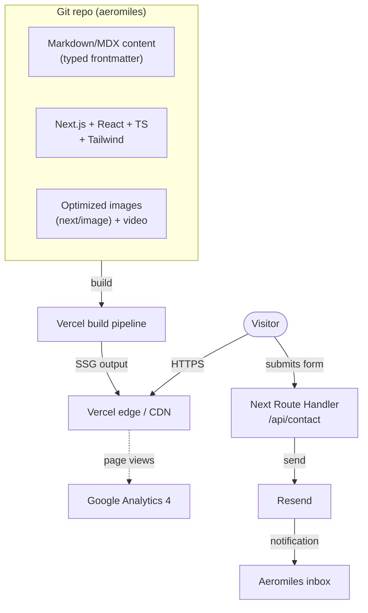
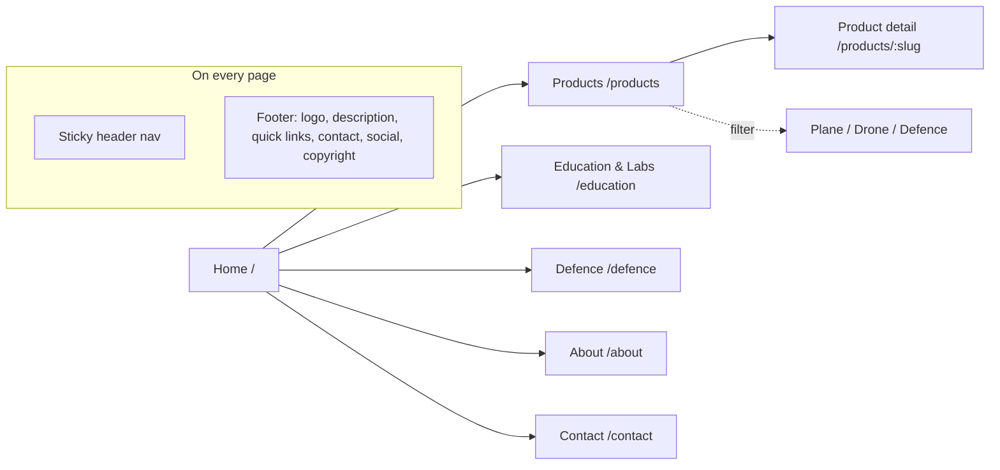
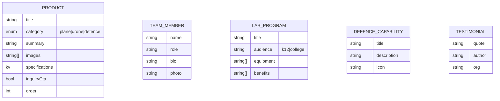

# Aeromiles Marketing Website — Product Requirements Document

**Version:** 1.0
**Date:** 2026-09-14
**Status:** Approved for architecture
**Owner:** Khetan Technologies (Manager)
**Related docs:** `../Aeromiles_One_Page_Documentation.docx` (original brief) · `../Aeromiles_Animation_Spec.md` (motion spec)

---

## 1. Overview & Vision

Aeromiles designs and builds **RC planes and drones**, sets up **K–12 and college aeromodelling / STEM labs**, and delivers **drone capability for defence and government** buyers. The website is a professional content/marketing site whose job is to **generate qualified inquiries** and **establish credibility** across three distinct audiences.

**Vision:** A premium, animated, distinctly-Indian aviation site that feels like *precision flight* — visually on par with reference sites [aerobay.in](https://aerobay.in/) and [vayumandalinnovations.com](https://www.vayumandalinnovations.com/), but credible enough for defence/government procurement.

**Primary success metric:** volume and quality of inquiries (contact/inquiry form submissions), with brand credibility as a co-equal goal.

---

## 2. Goals & Non-Goals

### Goals (v1)
- Showcase RC planes and drones with photos, descriptions, and specifications.
- Generate qualified inquiries via prominent CTAs and validated contact/inquiry forms.
- Win K–12 and college lab-setup contracts.
- Establish professional credibility for defence/government buyers.
- Present founder/co-founder experience; make contact details easy to find.
- Deliver the full multi-page site with a rich-but-tasteful motion layer.
- Meet Lighthouse 90+ and WCAG 2.1 AA.

### Non-Goals (v1)
- **No e-commerce / online purchasing** — inquiry-driven, not transactional.
- **No user accounts / login / LMS** — unlike AeroBay's `lms.` subdomain.
- **No client self-service CMS in v1** — content edited in-repo (see §5).
- **No publication of classified or export-controlled defence detail** — general capability only.
- **No multi-language** in v1 (English only).
- **No blog** in v1 (can be added later via Content Collections).

---

## 3. Target Users & Roles

### Site audiences (visitors)
| Audience | Who | Goal on site | Primary conversion |
|---|---|---|---|
| **Schools & colleges** | Administrators, principals, department heads | Evaluate STEM/aeromodelling labs | "Request a lab proposal" form |
| **Defence & government** | Procurement teams | Assess drone capability & credibility | Serious inquiry form |
| **Hobbyists / RC enthusiasts** | Individuals | Browse products & specs | Product inquiry / contact |

All three are built to **equal depth** in v1.

### Operational roles (people who run it)
| Role | Permission / responsibility |
|---|---|
| **Dev team (Khetan)** | Build, edit content via Markdown + PRs, deploy |
| **Aeromiles staff** | Receive form submissions by email + host dashboard |
| **Manager / PO** | Approve content, defence copy, launch |

No authenticated roles exist *on the site itself* in v1.

---

## 4. System Architecture

### 4.1 Stack

| Layer | Choice | Notes |
|---|---|---|
| Framework | **Next.js (App Router) + React + TypeScript** | SSG for marketing pages; real HTML for SEO; `next/image` optimization; TS strict |
| Styling | **Tailwind CSS** | Utility-first; brand tokens in Tailwind theme / CSS variables |
| Content | **In-repo Markdown/MDX** with typed frontmatter (gray-matter/Contentlayer + zod) | Products, labs, defence, team, testimonials as local content — read at build; no CMS in v1 |
| Motion | **Framer Motion** for React reveals/transitions + IntersectionObserver; **Swiper** (carousels), **CountUp** (stats), optional **Vanilla-Tilt**; **GSAP** only where needed | See `Aeromiles_Animation_Spec.md` |
| Forms | **Next.js Route Handler + Resend** *(recommended default — confirm at deploy)* | Serverless API route emails submissions via Resend; validate + spam-protect |
| Hosting | **Vercel** *(recommended default)* | Natural home for Next.js; Netlify is a viable alternative |
| Analytics | **Google Analytics 4** | Add cookie/consent handling per privacy note |
| Domain | **Client-owned** (likely `aeromiles.in` — to confirm) | DNS pointed at host at launch |

### 4.2 High-level architecture

### 4.3 Information architecture / sitemap

### 4.4 Content model (Content Collections)

---

## 5. Feature Spec by Area

### 5.1 Global (all pages)
- **Sticky header**: transparent over hero → gains blur/background/shadow + condenses on scroll. Logo + nav (Home, Products, Education/Labs, Defence, About, Contact) + primary CTA. Mobile hamburger drawer.
- **Footer**: logo, short company description, quick links, contact details, social links, copyright.
- **Motion baseline**: scroll-reveal on sections (reveal-once), smooth anchor scroll, `prefers-reduced-motion` fallback everywhere.

### 5.2 Home
Hero (**background flight video**, muted autoplay + poster fallback; placeholder footage until real footage supplied) with animated headline, subhead, CTA → three audience paths (hover-lift cards, brand-accent bars) → animated **stat counters** (navy band) → featured products (card lift + image zoom) → Education/Labs teaser → Defence teaser (restrained) → team teaser → trust marquee → contact CTA band.

### 5.3 Products
- Grid of products from Content Collections; **filter by Plane / Drone / Defence**.
- Product detail page: name, photo gallery (optional lightbox/zoom — enhancement), description, key specifications, category, inquiry CTA.

### 5.4 Education / Labs
- Program overview; equipment / curriculum / training / support; K–12 and college sections; benefits; photos/testimonials; **"Request a lab proposal" CTA/form**.

### 5.5 Defence
- Credible **general** capabilities; compliance/quality statements where applicable; **serious inquiry form**. **No classified/export-controlled detail.** Deliberately restrained motion (subtle reveals only).

### 5.6 About
- Company story/history, milestones (timeline), founder & co-founder bios/photos.

### 5.7 Contact
- Company head details, **inquiry form** (validated, spam-protected, email delivery + stored), optional map, social links. Form fields capture audience type to route/qualify leads.

---

## 6. Non-Functional Requirements

| Area | Requirement |
|---|---|
| **Performance** | Lighthouse 90+; optimized WebP/AVIF; lazy-load media; hero video `playsinline`/muted, poster fallback, mobile-conscious; minimal motion JS |
| **Accessibility** | WCAG 2.1 AA; keyboard-operable nav & carousels; visible focus; `prefers-reduced-motion` fallback; semantic headings; alt text |
| **Responsive** | Mobile-first; verified from ~360px to desktop |
| **SEO** | Page titles/meta descriptions, Open Graph, `sitemap.xml`, `robots.txt`, semantic HTML, structured headings |
| **Security/Privacy** | HTTPS; form spam protection; no PII in URLs; GA4 with appropriate consent handling; no sensitive defence data published |
| **Motion** | No layout-shift animations (opacity/transform only); reveal-once; smooth easing `cubic-bezier(.16,.84,.44,1)` |
| **Maintainability** | Content in Markdown/MDX; reusable React components; brand tokens centralized |

---

## 7. Open Decisions (non-blocking, track to launch)

| # | Decision | Owner | Default / status |
|---|---|---|---|
| O1 | Confirm hosting + forms = Vercel + Next Route Handler + Resend | Manager | Recommended default; confirm at deploy |
| O2 | Exact domain name | Client | Client-owned; likely `aeromiles.in` — confirm |
| O3 | Form recipient email address(es) | Client | **Required before launch** |
| O4 | Real flight footage for hero video | Client | Placeholder until supplied |
| O5 | Publicly cleared defence copy | Client | Approved copy required before Defence page goes live |
| O6 | Founder/co-founder bios + photos | Client | Placeholder until supplied |
| O7 | Product list, specs, and photos | Client | Sample/placeholder data until supplied |
| O8 | Social links | Client | Needed for header/footer |
| O9 | Launch date | Manager/Client | TBD |
| O10 | GA4 property + consent/cookie approach | Manager | Set up during build |

---

## 8. Decision Log

| Date | Decision | Rationale |
|---|---|---|
| 2026-09-14 | **Full multi-page site** in v1 (Home, Products, Education/Labs, Defence, About, Contact) | Client wants complete brief delivered, not phased |
| 2026-09-14 | **All three audiences at equal depth** | No single priority audience; balanced homepage |
| 2026-09-14 | Primary metric = **qualified inquiries**; credibility co-equal | Matches brief objectives |
| 2026-09-14 | ~~Astro + Tailwind~~ → **Next.js (App Router) + React + TypeScript + Tailwind** | Manager elected React/TS; Next.js chosen over Vite SPA for SEO (SSG, real HTML, metadata) — matches vayumandalinnovations.com |
| 2026-09-14 | **In-repo Markdown/MDX** with typed frontmatter (gray-matter/Contentlayer + zod) | Keeps content as data, no CMS in v1 (framework changed from Astro Content Collections to Next-compatible MDX) |
| 2026-09-14 | ~~Netlify + Netlify Forms~~ → **Vercel + Next Route Handler + Resend** (recommended default) | Natural Next.js host; serverless API route for forms; confirm at deploy (O1) |
| 2026-09-14 | Domain is **client-owned/purchased** | Point DNS at host at launch (O2) |
| 2026-09-14 | Hero = **background flight video** (poster + placeholder until footage) | Highest impact; degrade gracefully |
| 2026-09-14 | Motion level = **rich but tasteful**, restrained on Defence | Premium feel without undermining defence credibility |
| 2026-09-14 | Content = **mostly placeholders** for v1, swap as delivered | Keeps build moving while assets are gathered |
| 2026-09-14 | Analytics = **Google Analytics 4** | Familiar, free (O10) |
| 2026-09-14 | **No e-commerce, no accounts/LMS, no CMS, no i18n, no blog** in v1 | Scope discipline |

---

## 9. What's Next

1. Run **`/draft-architecture`** to convert this PRD + repo into the project's `CLAUDE.md` (architecture rules the dev team codes against).
2. Then kick off features one at a time with **`/draft-brief <feature>`** (e.g. `/draft-brief homepage hero`, `/draft-brief products listing + filter`, `/draft-brief contact form`).
3. Gather the **Open Decisions** (§7) assets from the client in parallel — especially form recipient email, defence copy, and product data — so pages can move from placeholder to real content.
